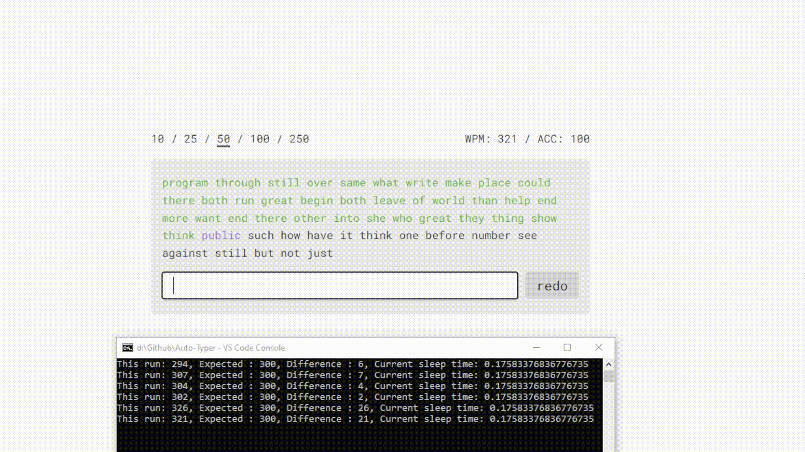

# Python Auto Typer

Completes automated [typings.gg](https://typings.gg/) test at a specified WPM, taking into account specific computational delays

## Currently
In it's current state, the auto typer asks the user how many WPM(words per minute) they would like to complete the test with.
It does 10 calibration rounds, and tests the limits of the computer by calculating the average time to enter each word with no limitations. 
It then subtracts the computational delays from the entry speed which would yield the WPM given no computational delays.
The program runs the test until it reaches the WPM on a test that was initially input by the user, and when it does it outputs a scatter plot of the tests

## Future
ideally, the test will make small readjustments after each test to zero in on the specified WPM, but that doesn't seem viable from my testing
The best we can do if that is out of the question is run tests and take the average from a scatter plot of sorts.

## Purpose
This was more of a proof of concept program I wrote to learn selenium with the idea of straining and comparing CPU outputs. 
After a conversation with my dad, though, the idea came up to create a speed reader Javascript application that that shows the text on the screen in a faster manner in a single place to help improve reading times.